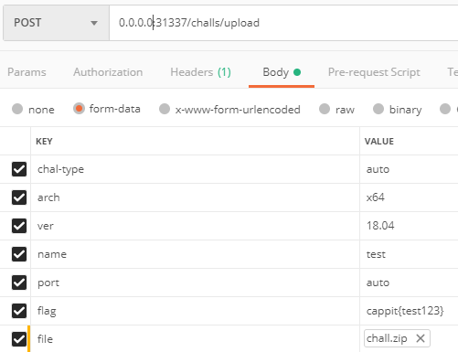
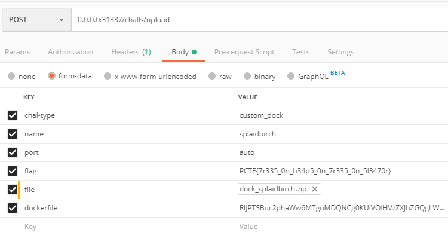

# APIs

# 1. List

Get list of challenges deployed on server.


## Specifications

- **Endpoint**: /challs
- **Method**: GET
- **Header**: Not required
- **Response:**

**On success**, it responds with jsonified status of challenges.

**On error,**

- Wrong method(405)

    ```json
    {
    "message": "The method is not allowed for the requested URL."
    }
    ```


## Example

    [request]
    GET /challs HTTP/1.1
    User-Agent: PostmanRuntime/7.21.0
    Accept: */*
    Cache-Control: no-cache
    Postman-Token: 0033f90b-7b17-4a4f-a1fe-1317e10ace69
    Host: 0.0.0.0:31337
    Accept-Encoding: gzip, deflate
    Connection: keep-alive
    
    [response]
    HTTP/1.0 200 OK
    Content-Type: application/json
    Content-Length: 79
    Access-Control-Allow-Origin: *
    Server: Werkzeug/0.15.4 Python/3.5.2
    Date: Tue, 07 Jan 2020 13:44:47 GMT
    
    [
    {
    "name": "test",
    "port": "31001",
    "status": "running"
    }
    ]


---

# 2. Deploy

Upload challenge, build docker image, and run container.


## Specifications

- **Endpoint:** /challs/upload
- **Method:** POST
- **Header:** Not required
- **Body**
    - chal-type: Set type of deployment.
        - auto: Generate dockerfile, build image, run container would be fully automated.
        - custom_dock: Write dockerfile yourself. Other things are same as auto.
    - arch: Challenge is built for this architecture. *Not required on custom_dock.*
    Only supports **x86 and x64.**
    - ver: Challenge would be run on this version of ubuntu. *Not required on custom_dock.*
    Only supports **16.04 and 18.04.**
    - name: Challenge name. If name is already in used, error occurs.
    - port: Challenge would be run on this port.
        - auto: papaWhaled will automatically select port that is not used.
        - [31000-32000]: If port is aleready in used, error occurs.
    - file: Challenge zip file. File must include "**props.json", binary and test script.**
        - props.json: Pass the role of included files. Can have following key-values.

            "bin": name of challenge file
            "test": test script or binary

        - binary: challenge file
        - test script: It would be used to determine whether challenge is successfully deployed or not.
    - flag: Solver would get this flag.
    - dockerfile: Written docker file. **Must be encoded as base64.** *Not required on auto.*
- **Response:**

**On success,** 

```json
{
    "port": "31000",
    "status": 200,
    "body": "Challenge 'test' is now running on 31000"
}
```

**On error,**

- Name already in used.

    ```json
    {
        "port": 0,
        "status": 409,
        "body": "[name] is already registred. Please use another name."
    }
    ```

- Port already in used.

    ```json
    {
        "port": 0,
        "status": 409,
        "body": "port [port] is already used."
    }
    ```

- Failed to build

    ```json
    {
        "port": 0,
        "status": 521,
        "body": "Failed to build image."
    }
    ```

- Failed to run

    ```json
    {
        "port": 0,
        "status": 522,
        "body": "Failed to run container"
    }
    ```

- Challenge zip file is invalid

    ```json
    {
        "port": 0,
        "status": 400,
        "body": "Request is invalid. Check your chall.zip again please."
    }
    ```

- Test is failed.

    ```json
    {
        "port": 0,
        "status": 520,
        "body": "Test has failed. Something is wrong on your challenge binary or test file"
    }
    ```


## Example

### **Auto**




### Custom_dock



```dockerfile
//dockerfile: encode it as base64 to pass it into request body.
FROM nsjail:18.04
RUN useradd -m -d /home/user -s /bin/bash -u 1000 user
COPY {bin} /home/user/{bin}
COPY flag /home/user/flag
COPY libsplaid.so.1 /usr/lib/libsplaid.so.1
CMD su user -c 'nsjail -Ml --port 31000 --chroot / --user 1000 --group 1000 /home/user/{bin}'
EXPOSE 31000
```


---

# 3. Restart

Restart the specific challenge.


## Specifications

- **Endpoint**: /challs/restart
- **Method**: POST
- **Header**: Not required
- **Body**
    - name: name of the challenge which needs to be restart.
- **Response**

**On success,** 

```json
{
    "status": 200,
    "port": 0,
    "body": "Restart splaidbirch succeed."
}
```

**On error,**

- Name not exist.

    ```json
    {
        "status": 404,
        "port": 0,
        "body": "Challenge hahihooheho is not exist."
    }
    ```
    
    

---

# 4. Terminate

Terminate challenge conatiner and delete every resources related with the challenge.

## Specifications

- **Endpoint**: /chllas/term
- **Method**: POST
- **Header**: Not required
- **Body**
    - name: name of the challenge which needs to be terminated.
- **Response**