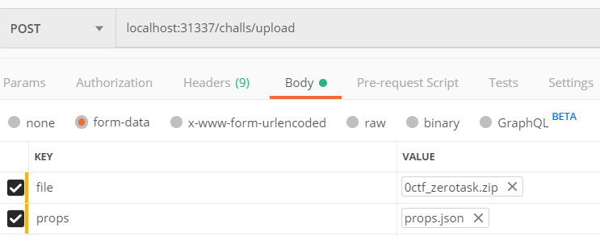
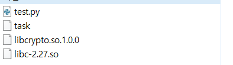

# APIs(v1.1)

---

# 1. List

Get list of challenges deployed on server.

## Specifications

- **Endpoint**: /challs
- **Method**: GET
- **Header**: Not required
- **Response:**

**On success**, it responds with jsonified status of challenges.

**On error,**

- Wrong method(405)

    ```json
    {
    "message": "The method is not allowed for the requested URL."
    }
    ```

## Example

    [request]
    GET /challs HTTP/1.1
    User-Agent: PostmanRuntime/7.21.0
    Accept: */*
    Cache-Control: no-cache
    Postman-Token: 0033f90b-7b17-4a4f-a1fe-1317e10ace69
    Host: 0.0.0.0:31337
    Accept-Encoding: gzip, deflate
    Connection: keep-alive
    
    [response]
    HTTP/1.0 200 OK
    Content-Type: application/json
    Content-Length: 79
    Access-Control-Allow-Origin: *
    Server: Werkzeug/0.15.4 Python/3.5.2
    Date: Tue, 07 Jan 2020 13:44:47 GMT
    
    [
    {
    "name": "test",
    "port": "31001",
    "status": "running"
    }
    ]

---

# 2. Deploy

Upload challenge, build docker image, and run container.

## Specifications

- **Endpoint:** /challs/upload
- **Method:** POST
- **Header:** Not required
- **Body**
    - props: Property json file. Name must be `props.json`. Check detail at [here](https://www.notion.so/hhro/About-props-json-c5c376b31cb243f1bc39fc6591732951).
    - file: Challenge zip file.
- **Response:**

**On success,** 

```json
{
    "port": "31000",
    "status": 200,
    "body": "Challenge 'test' is now running on 31000"
}
```

**On success, and libs are passed** 

```json
{
    "status": 200,
    "body": "Challenge 'zerotask' is now running on 31000",
    "port": "31000",
    "libs": [
        "50390b2ae8aaa73c47745040f54e602f",
        "18403538a12facf8aced1dcfcccef1ba"
    ]
}
```

**On error,**

- Name already in used.

    ```json
    {
        "port": 0,
        "status": 409,
        "body": "[name] is already registred. Please use another name."
    }
    ```

- Port already in used.

    ```json
    {
        "port": 0,
        "status": 409,
        "body": "port [port] is already used."
    }
    ```

- Failed to build

    ```json
    {
        "port": 0,
        "status": 521,
        "body": "Failed to build image."
    }
    ```

- Failed to run

    ```json
    {
        "port": 0,
        "status": 522,
        "body": "Failed to run container"
    }
    ```

- Challenge zip file is invalid

    ```json
    {
        "port": 0,
        "status": 400,
        "body": "Request is invalid. Check your chall.zip again please."
    }
    ```

- Test is failed.

    ```json
    {
        "port": 0,
        "status": 520,
        "body": "Test has failed. Something is wrong on your challenge binary or test file"
    }
    ```
    
    

## Example

### docker

- POST



- props.json

    ```json
    {
        "name":"zerotask",
        "bin":"task",
        "flag":"flag{pl4y_w1th_u4F_ev3ryDay_63a9d2a26f275685665dc02b886b530e}",
        "port":"auto",
        "arch":"x64",
        "os":"ub1804",
        "libs":["libc-2.27.so","libcrypto.so.1.0.0"],
        "chall_type":"docker",
        "dock_opts":["COPY libcrypto.so.1.0.0 /usr/lib/"],
        "dist":["bin","libs"]
    }
    ```

- 0ctf_zerotask.zip



---

# 3. Restart

Restart the specific challenge.

## Specifications

- **Endpoint**: /challs/restart
- **Method**: POST
- **Header**: Not required
- **Body**
    - name: name of the challenge which needs to be restart.
- **Response**

**On success,** 

```json
{
    "status": 200,
    "port": 0,
    "body": "Restart splaidbirch succeed."
}
```

**On error,**

- Name not exist.

    ```json
    {
        "status": 404,
        "port": 0,
        "body": "Challenge hahihooheho is not exist."
    }
    ```
    
    

---

# 4. Terminate

Terminate challenge conatiner and delete every resources related with the challenge.

## Specifications

- **Endpoint**: /chllas/term
- **Method**: POST
- **Header**: Not required
- **Body**
    - name: name of the challenge which needs to be terminated.

---

# 5. Download challenge

Download the challenge distribution.

## Specifications

- **Endpoint**: /chllas/download/{string:name}
- **Method**: GET
- **Header**: Not required
- **Body**
    - name: challenge name

---

# 6. Download library

Download the library.

## Specifications

- **Endpoint**: /libs/download/{string:hint}
- **Method**: GET
- **Header**: Not required
- **Body**
    - hint: md5sum of library file
